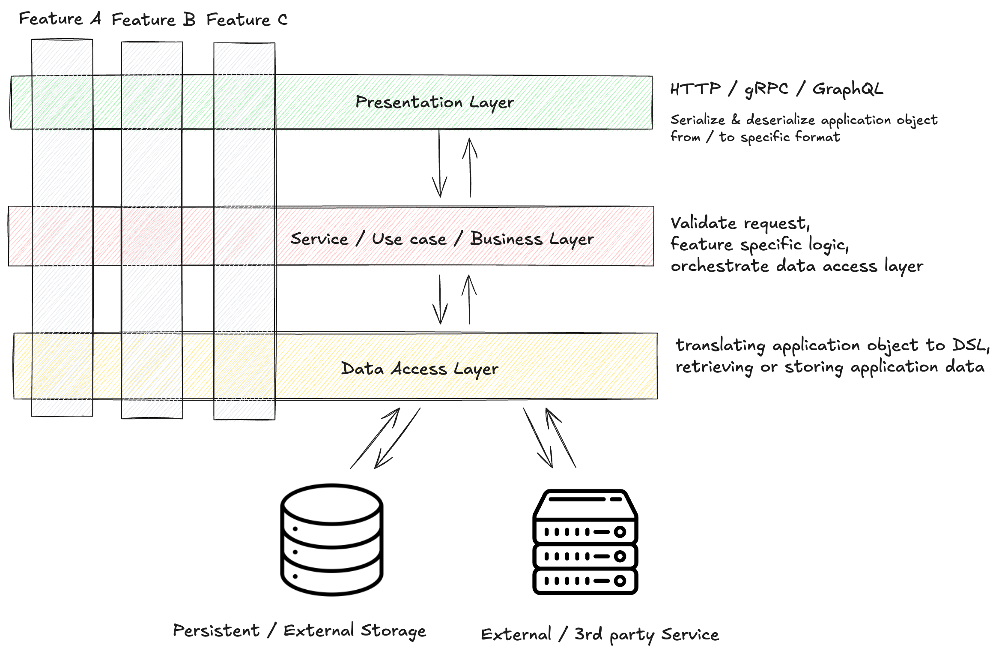

# Blog API

Live URL: https://forward-blog-api.fahrezy.work

## Setup and running instructions

### Prerequisites

- Go 1.25 or higher
- Make (optional, for build automation)

#### Local Development

1. **Clone the repository**:

```bash
git clone <repository-url>
cd <clone directory>
```

2. **Install dependencies**:

```bash
go mod download
```

3. **Setup environment**:

```bash
cp .env.example .env
# Edit values on the .env with the real value if needed
```

4. **Generate API documentation**:

```bash
make swagger
```

5. **Start the server**:

```bash
make run
```

### Testing

Integration testing only, so we don't have to create or wrting mock.

Pros:

- Test against real thing
- Straighforward

Cons:

- Consume more resource to spin up external dependencies like database
- Slower
- Hard to test with 3rd party integration

```bash
# Run all tests
make test
```

### Build the Application

#### Without Docker

```bash
go build -o <executable name> ./cmd/api
```

#### With Docker

```bash
docker -t <container name:tag> build .
```

#### Run with Docker Compose

```bash
docker compose up --build
```

## Architecture explanation

### System Architecture



Using 3 tier architecture with vertical slicing, Handler <-> Service <-> Repository. Using this architecture, make it easier to supporting multiple presentation layer, hiding the implementation detail to integrate with other resources, and make it easier to change implementation for integrating with other resources.

### Project Structure

```
project-root/
├── cmd/
│   ├── api/                      # HTTP server entry point with Swagger annotations
│   └── migrate/                  # Database migration CLI for managing database migration
├── internal/                     # Shared packages
│   ├── config/                   # Configuration management
│   ├── database/                 # Database connection management
│   ├── error/                    # Custom error for the project
│   ├── health/                   # Application health status checker
│   ├── logger/                   # Configuration structured logging utilities
│   ├── server/                   # Generic HTTP server with Swagger documentation
│   └── <feature_name>/           # Vertical slicing feature-based modules
│       ├── entity.go             # DTO object and domain model
│       ├── error.go              # Custom error for specific feature
│       ├── handler/              # Presentation layer
│       │   ├── http.go           ## HTTP Route registration
│       │   ├── http_test.go      ## HTTP integration test setup
│       │   ├── <method>.go       ## Handler for the entrypoint
│       │   └── <method>_test.go  ## Handler integration test
│       ├── repository/           # Data access layer
│       │   └── <method>.go       ## Fetching or storing data to persitance or external resource
│       └── service/              # Business logic layer
│           └── <method>.go       ## Main logic for the usecase, handling request from presentation layer and integrating repository
├── docs/                         # Generated Swagger documentation
└── Makefile                      # Build and development commands
```

## Technology choices justification

- `Go`, with the simplicity it offers, it able to build a API server that has good performance (based on benchmark on the internet), producing single binary make it easier to move around, and lower memory footprint.
- `slog`, built in logger from Go, fast (their claim), able produce source where the log called, support JSON or text format, and support multiple severity level.
- `net/http`, built in API server from Go, simple, cover most of feature for API like path parameter, http method, and form data.
- `PostgreSQL`, open-source
- `Swagger`, popular tool for serving `OpenAPI` spec, and easy to integrate with Go.
- `ory/dockertest`, make integration testing easy with managing ephermal Docker container for database.
- `Docker`, for easy and deterministic deployment.

## Known limitations and future improvements

- Dependency inversion, existing implementation pass the concrete object to each layer as there is only 1 implementation for each layer and use integration test approach for testing. Could be use interface if in the future need to have test against mock object, so the dependency is interchangeable.
- Test coverage, the coverage that collected is only for the feature, the project config or infrastructure setup is not tested yet. There is only integration test yet, it could be improved to have unit test too in the future.
- JWT configuration, the checking for the JWT only check it's validity and it has long lifetime, in the future could be improved to check the `iat`, `nbf`, `aud`, `iss`, and make it short life then implement refresh token.
- Logging, the log for the app only log the endpoint hit, implement comprehensive logging later to log the request payload and other data for easy debugging.

## Test coverage report


