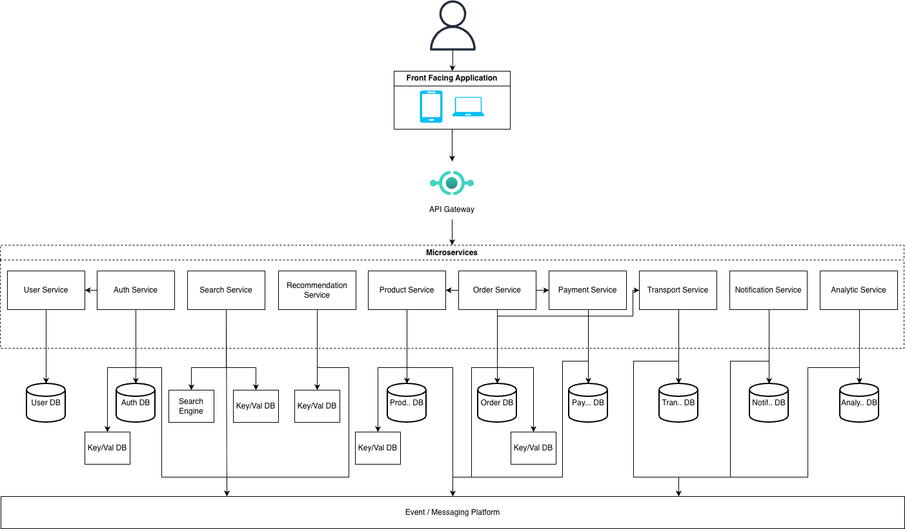

# E-Commerce Design Excercise

## Disclaimer

The author doesn't have any experience that relate to E-Commerce domain nor designing system architecture before.

## High-level architecture diagram



### Registration Flow

- User Register through `Auth Service`.
- `Auth Service` call `User Service` to create profile.
- `Auth Service` publish event to `Kafka`.
- `Notification Service` consume the user registartion event to create welcome email.
- `Analytic Service`consume the user registartion event for log track user registration metric.

### Login Flow

- `Auth Service` validate the request to `Auth DB`.
- `Auth Service` create session or auth token.

### Browse & Search Flow

- Fetch product list from `Product Service`.
- Handle search from `Search Service`.
- Show recommendation producs from `Recommendation Service`.

### Add to Cart Flow

- `Order Service` validates product to `Product Service`.
- `Order Service` store the cart on `Redis`.

### Checkout Flow

- `Order Service` validates cart item.
- `Order Service` call `Product Service` to reserve product.
- `Order Service` call `Transport Service` to calculate shipping cost.
- `Order Service` call `Payment Service` to process the payment.
- `Payment Service` call webhook to `Order Service`
- `Order Service` publish event to `Kafka`.

### Order Processing Flow

- `Product Service` consume order event from `Kafka` to deduct stock.
- `Notification Service` consume order event from `Kafka` to send confimation notification.
- `Transport Service` consume order event from `Kafka` to create shipping.
- `Analytic Service` consume order event from `Kafka` for processing.

### Shipping Flow

- `Transport Service` retreive websockt from shipping provider.
- `Transport Service` publish event to `Kafka`.
- `Order Service` consume event from `Kafka` to update the order status.

### Search & Recommendation Ingestion

- `Product Service` publish create or update product event to `Kafka`.
- `Search Service` consume the event to update data in `ElasticSearch`.
- `Recommendation Service` consume the event to update the data in `Redis`.

## Tech stack

Here are the tech stacks of choices, the reason why choose it, and the altenative(s).

### API Gateway

[Traefik](https://github.com/traefik/traefik)

- The most popular API gateway (https://ossinsight.io/collections/api-gateway/trends)
- Open source
- All-in-one for API Gateway and proxy
- Built-in auto-discovery of services with Kubernetes
- Observability follows OpenTelemetry semantic conventions (portable, no vendor lock-in)

Alternative(s): [Kong](https://github.com/Kong/kong), [Envoy](https://github.com/envoyproxy/envoy)

### Infastructure

[Kubernetes](https://github.com/kubernetes/kubernetes)

- Well known Container Orchestration
- Open source
- Vast ecosystem and third-party extensions

Alternative(s): [Nomad](https://github.com/hashicorp/nomad), [Docker Swarm](https://docs.docker.com/engine/swarm/)

### Database

[Postgres](https://github.com/postgres/postgres)

- Open source
- Conforms to at least 170 of the 177 mandatory features for SQL:2023 (at time writing this)

Alternative(s): [MariaDB](https://github.com/MariaDB/server)

[ClickHouse](https://github.com/ClickHouse/ClickHouse)

- Open Source
- Fast
- Support SQL for querying the data

Alternative(s): [TimescaleDB](https://github.com/timescale/timescaledb)

[Redis](https://github.com/redis/redis)

- Well known key-val database
- Re-open source

Alternative(s): [Valkey](https://github.com/valkey-io/valkey), [Dragonfly](https://github.com/dragonflydb/dragonfly), [Memcached](https://github.com/memcached/memcached)

### Event Streaming

[Kafka](https://github.com/apache/kafka)

- Well known event streaming platform

Alternative(s): [RabbitMQ](https://github.com/rabbitmq/rabbitmq-server), [Redpanda](https://github.com/redpanda-data/redpanda)

### Search Engine

[Elasticsearch](https://github.com/elastic/elasticsearch)

- Well known search engine
- Re-open source

Alternative(s): [Meilisearch](https://github.com/meilisearch/meilisearch), [Typesense](https://github.com/typesense/typesense)

### Logging & Monitoring

[Loki](https://github.com/grafana/loki), [Grafana](https://github.com/grafana/grafana), [Tempo](https://github.com/grafana/tempo), [Mimir](https://github.com/grafana/mimir).

- Highly customizalbe
- Available to self-hosted

Alternative(s): [SigNoz](https://github.com/SigNoz/signoz) [Elasticsearch](https://github.com/elastic/elasticsearch), [Logstash](https://github.com/elastic/logstash), [Kibana](https://github.com/elastic/kibana)

## Database Schema

### User Service

#### PostgreSQL

```sql
CREATE TABLE users (
    id UUID PRIMARY KEY DEFAULT gen_random_uuid(),
    email VARCHAR(255) UNIQUE NOT NULL,
    first_name VARCHAR(100) NOT NULL,
    last_name VARCHAR(100) NOT NULL,
    phone VARCHAR(20) NOT NULL,
    created_at TIMESTAMPTZ DEFAULT NOW(),
    updated_at TIMESTAMPTZ DEFAULT NOW()
);

CREATE TABLE addresses (
    id UUID PRIMARY KEY DEFAULT gen_random_uuid(),
    user_id UUID NOT NULL REFERENCES users(id) ON DELETE CASCADE,
    label VARCHAR(50) NOT NULL,
    province_id INT NOT NULL,
    province_name VARCHAR(100) NOT NULL,
    city_id INT NOT NULL,
    city_name VARCHAR(100) NOT NULL,
    district_id INT NOT NULL,
    district_name VARCHAR(100) NOT NULL,
    subdistrict_id INT NOT NULL,
    subdistrict_name VARCHAR(100) NOT NULL,
    street VARCHAR(255) NOT NULL,
    postal_code VARCHAR(20) NOT NULL,
    is_default BOOLEAN DEFAULT FALSE,
    created_at TIMESTAMPTZ DEFAULT NOW()
);
```

### Auth Service

#### PostgreSQL

```sql
CREATE TABLE credentials (
    id UUID PRIMARY KEY DEFAULT gen_random_uuid(),
    user_id UUID UNIQUE NOT NULL,
    email VARCHAR(255) UNIQUE NOT NULL,
    password_hash VARCHAR(255) NOT NULL,
    email_verified BOOLEAN DEFAULT FALSE,
    status VARCHAR(20) DEFAULT 'active',
    created_at TIMESTAMPTZ DEFAULT NOW(),
    updated_at TIMESTAMPTZ DEFAULT NOW()
);
```

#### Redis

- `session:{user_id}`: JWT metadata (TTL: 7 days)
- `refresh:{token_id}`: refresh token (TTL: 30 days)
- `blacklist:{token_id}`: invalidated token, to prevent re-use the token from logged out user (TTL: until expiry (remaining token lifetime))
- `otp:{user_id}:{type}`: OTP code per type (email verification or phone verification) (TTL: 5 min)
- `otp_attempts:{user_id}:{type}`: attempt count per type (TTL: 15 min)

### Product Service

#### PostgreSQL

```sql
CREATE TABLE products (
    id UUID PRIMARY KEY DEFAULT gen_random_uuid(),
    sku VARCHAR(50) UNIQUE NOT NULL,
    name VARCHAR(255) NOT NULL,
    description TEXT DEFAULT '',
    price DECIMAL(12,2) NOT NULL,
    status VARCHAR(20) DEFAULT 'active', -- active, inactive
    created_at TIMESTAMPTZ DEFAULT NOW(),
    updated_at TIMESTAMPTZ DEFAULT NOW()
);

CREATE TABLE inventory (
    id UUID PRIMARY KEY DEFAULT gen_random_uuid(),
    product_id UUID NOT NULL REFERENCES products(id),
    quantity INT NOT NULL DEFAULT 0,
    reserved INT NOT NULL DEFAULT 0,
    version INT DEFAULT 1,
    updated_at TIMESTAMPTZ DEFAULT NOW(),
    UNIQUE(product_id)
);
```

#### Redis

- `product:{id}`: product cache (TTL: 15 min)
- `inventory:{product_id}` -> available quantity (for fast check or showing available quantity for search or recommendation product, updated every product quantity change)

### Order Service

#### PostgreSQL

```sql
CREATE TABLE orders (
    id UUID PRIMARY KEY DEFAULT gen_random_uuid(),
    order_number VARCHAR(20) UNIQUE NOT NULL,
    user_id UUID NOT NULL,
    status VARCHAR(20) DEFAULT 'pending', -- pending, paid, processing, shipped, delivered, cancelled, refunded
    subtotal DECIMAL(12,2) NOT NULL,
    shipping_amount DECIMAL(12,2) DEFAULT 0,
    total_amount DECIMAL(12,2) NOT NULL,
    shipping_address JSONB NOT NULL, -- the snapshot for user address
    created_at TIMESTAMPTZ DEFAULT NOW(),
    updated_at TIMESTAMPTZ DEFAULT NOW()
);

CREATE TABLE order_items (
    id UUID PRIMARY KEY DEFAULT gen_random_uuid(),
    order_id UUID NOT NULL REFERENCES orders(id) ON DELETE CASCADE,
    product_id UUID NOT NULL,
    product_name VARCHAR(255) NOT NULL,
    unit_price DECIMAL(12,2) NOT NULL,
    quantity INT NOT NULL,
    total_amount DECIMAL(12,2) NOT NULL,
    product_snapshot JSONB NOT NULL
);

CREATE TABLE complaints (
    id UUID PRIMARY KEY DEFAULT gen_random_uuid(),
    order_id UUID NOT NULL,
    order_item_id UUID,
    user_id UUID NOT NULL,
    type VARCHAR(30) NOT NULL, -- defect, wrong_item, damaged, missing, other
    description TEXT NOT NULL,
    evidence_urls JSONB DEFAULT '[]',
    status VARCHAR(30) DEFAULT 'open', -- open, under_review, resolved, rejected
    resolution_type VARCHAR(30), -- refund, replacement, store_credit, rejected
    resolution_note TEXT,
    resolved_at TIMESTAMPTZ,
    created_at TIMESTAMPTZ DEFAULT NOW()
);
```

#### Redis

- `cart:{user_id}` -> cart items JSON (TTL: 30 days)

### Payment Service

#### PostgreSQL

```sql
CREATE TABLE transactions (
    id UUID PRIMARY KEY DEFAULT gen_random_uuid(),
    order_id UUID NOT NULL,
    user_id UUID NOT NULL,
    gateway VARCHAR(50) NOT NULL, -- payment provider
    gateway_transaction_id VARCHAR(255), -- payment provider reference id
    amount DECIMAL(12,2) NOT NULL,
    currency CHAR(3) DEFAULT 'IDR',
    status VARCHAR(30) NOT NULL, -- pending, processing, success, failed, expired, cancelled, refunding, refunded, refund_failed
    refund_reason VARCHAR(255),
    created_at TIMESTAMPTZ DEFAULT NOW(),
    updated_at TIMESTAMPTZ DEFAULT NOW()
);
```

### Transport Service

#### PostgreSQL

```sql
CREATE TABLE shipments (
    id UUID PRIMARY KEY DEFAULT gen_random_uuid(),
    order_id UUID NOT NULL,
    carrier VARCHAR(50), -- logistic provider
    tracking_number VARCHAR(100),
    status VARCHAR(30) DEFAULT 'pending', -- pending, picked_up, in_transit, out_for_delivery, delivered, failed, returned
    destination_address JSONB NOT NULL, -- complete address
    shipping_cost DECIMAL(12,2),
    estimated_delivery DATE,
    shipped_at TIMESTAMPTZ,
    delivered_at TIMESTAMPTZ,
    created_at TIMESTAMPTZ DEFAULT NOW()
);

CREATE TABLE tracking_events (
    id UUID PRIMARY KEY DEFAULT gen_random_uuid(),
    shipment_id UUID NOT NULL REFERENCES shipments(id),
    status VARCHAR(50) NOT NULL, -- order_received, packing, picked_up, arrived_facility, departed_facility, out_for_delivery, delivered, returned_to_sender
    location VARCHAR(255),
    created_at TIMESTAMPTZ DEFAULT NOW()
);
```

### Notification Service (PostgreSQL)

```sql
CREATE TABLE notifications (
    id UUID PRIMARY KEY DEFAULT gen_random_uuid(),
    user_id UUID NOT NULL,
    type VARCHAR(20) NOT NULL, -- like welcome, order_confirmation, promote
    channel VARCHAR(20) NOT NULL, -- email, sms, push, whatsapps
    recipient VARCHAR(255) NOT NULL,
    subject VARCHAR(255),
    content TEXT,
    status VARCHAR(20) DEFAULT 'pending', -- pending, sent, failed
    created_at TIMESTAMPTZ DEFAULT NOW(),
    updated_at TIMESTAMPTZ DEFAULT NOW()
);
```

### Analytic Service

#### ClickHouse

```sql
CREATE TABLE events (
    id UUID,
    event_type String,
    user_id UUID,
    data String,
    created_at DateTime DEFAULT now()
) ENGINE = MergeTree()
ORDER BY (event_type, created_at);

CREATE TABLE order_metrics (
    date Date,
    total_orders UInt32,
    total_revenue Decimal(12,2),
    avg_order_value Decimal(12,2)
) ENGINE = SummingMergeTree()
ORDER BY date;
```

### Search Service

#### Elasticsearch

```json
{
  "products": {
    "mappings": {
      "properties": {
        "id": { "type": "keyword" },
        "sku": { "type": "keyword" },
        "name": {
          "type": "text",
          "fields": { "keyword": { "type": "keyword" } }
        },
        "description": { "type": "text" },
        "price": { "type": "float" },
        "in_stock": { "type": "boolean" },
        "created_at": { "type": "date" }
      }
    }
  }
}
```

### Recommendation Service (Redis)

```
-- Redis Keys
-- rec:popular -> sorted set of product IDs by sales
-- rec:user:{user_id} -> list of recommended product IDs
-- rec:similar:{product_id} -> list of similar product IDs
```

## (Some) Potential Related API

### Auth Service

```
POST   /auth/register          # Register new user
POST   /auth/login             # Login
POST   /auth/logout            # Logout
POST   /auth/refresh           # Refresh token
POST   /auth/otp/send          # Send OTP
POST   /auth/otp/verify        # Verify OTP
POST   /auth/password/reset    # Reset password
```

### User Service

```
GET    /users/me               # Get current user profile
PATCH  /users/me               # Update profile
GET    /users/me/addresses     # List addresses
POST   /users/me/addresses     # Add address
PATCH  /users/me/addresses/:id # Update address
DELETE /users/me/addresses/:id # Delete address
```

### Product Service

```
GET    /products               # List products with pagination
GET    /products/:id           # Get product detail
GET    /products/:id/inventory # Get stock availability
GET    /products/inventory?ids= # Get stock availability
POST   /inventory/reserve      # Reserve stock
POST   /inventory/release      # Release stock
POST   /inventory/deduct       # Confirm deduction
```

### Search Service

```
GET    /search?q=              # Search products
GET    /search/suggestions?q=  # Autocomplete
```

### Recommendation Service

```
GET    /recommendations/popular           # Popular products
GET    /recommendations/user/:id          # For user
GET    /recommendations/similar/:productId # Similar products
```

### Order Service

```
GET    /cart                   # Get cart
POST   /cart/items             # Add to cart
PATCH  /cart/items/:id         # Update quantity
DELETE /cart/items/:id         # Remove item
DELETE /cart                   # Clear cart

POST   /checkout               # Create order from cart
GET    /orders                 # List user orders
GET    /orders/:id             # Get order detail
POST   /orders/:id/cancel      # Cancel order

POST   /orders/:id/complaint   # Create complaint for order
GET    /orders/:id/complaint   # Get complaint for order
PATCH  /orders/:id/complaint   # Update complaint (add evidence, update description)
POST   /orders/:id/complaint/resolve # Resolve complaint
```

### Payment Service

```
POST   /payments/intent        # Create payment intent
POST   /payments/confirm       # Confirm payment
POST   /payments/webhook       # Gateway webhook
GET    /payments/:orderId      # Get payment status
POST   /refunds                # Request refund
```

### Transport Service

```
POST   /shipping/rates         # Calculate shipping rates
GET    /shipments/:orderId     # Get shipment status
GET    /shipments/:id/tracking # Get tracking events
POST   /shipments/webhook      # Carrier webhook
```

### Notification Service

```
GET    /notifications          # List user notifications
PATCH  /notifications/:id/read # Mark as read
```

### Analytic Service

```
GET    /analytics/dashboard    # Dashboard metrics
GET    /analytics/orders       # Order metrics
```

## References

- https://medusajs.com/blog/ecommerce-architecture
- https://ngrok.com/blog/reverse-proxy-vs-api-gateway
- https://microservices.io/patterns
- https://konghq.com/blog/enterprise/why-kong-is-the-best-api-gateway
- https://www.qovery.com/blog/9-key-reasons-to-use-or-not-kubernetes-for-your-dev-environments
- https://www.prisma.io/dataguide/postgresql/benefits-of-postgresql